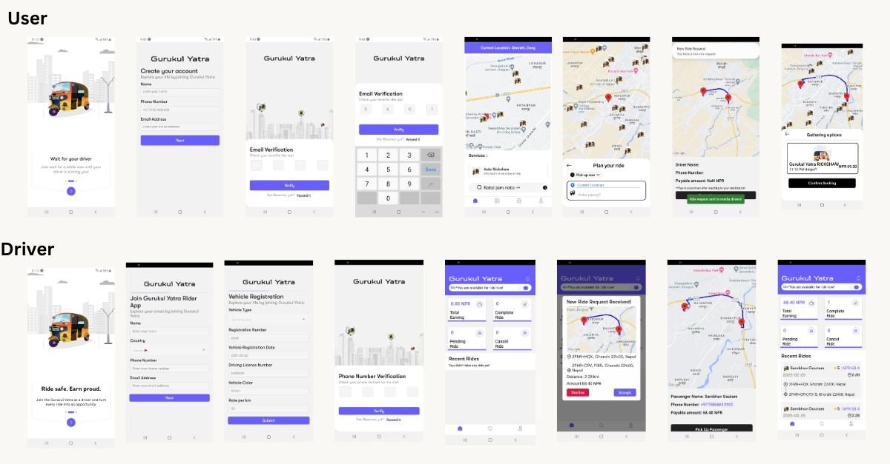

# 🚖 Gurukul Yatra – Ride Sharing App

Gurukul Yatra is a full-stack ride-hailing app built for both users and drivers in Nepal. The platform supports real-time location updates, ride requests, live tracking, push notifications, and more — inspired by apps like Pathao and Uber, but custom-built for local needs.

<p align="center">
  
</p>

---

## 🚀 Features

### 👤 User App
- OTP-based sign-up
- Real-time map and driver tracking
- Destination search with Google Places API
- Dynamic fare calculation
- Booking confirmation and history

### 🚗 Driver App
- Vehicle and license registration
- Accept/decline ride requests
- Track earnings and completed rides
- Real-time pickup location updates

---

## 🛠 Tech Stack

**Backend**
- Node.js + Express.js
- WebSocket (ws)
- Prisma ORM
- JWT Auth
- GeoLib for geofencing

**Frontend**
- React Native + Expo
- React Native Maps
- Google Directions & Places API
- Axios + AsyncStorage
- Push Notifications via Expo

---

## 💻 Installation & Usage

```bash
# Clone the repo
git clone https://github.com/iamsulavgautam/gurukul-yatra.git

# Install backend dependencies
cd gurukul-yatra
npm install

# Install frontend dependencies
cd app
npm install

# Start the backend server
cd ../server
node server.js

# Start the mobile app (Expo CLI required)
cd ../app
expo start
